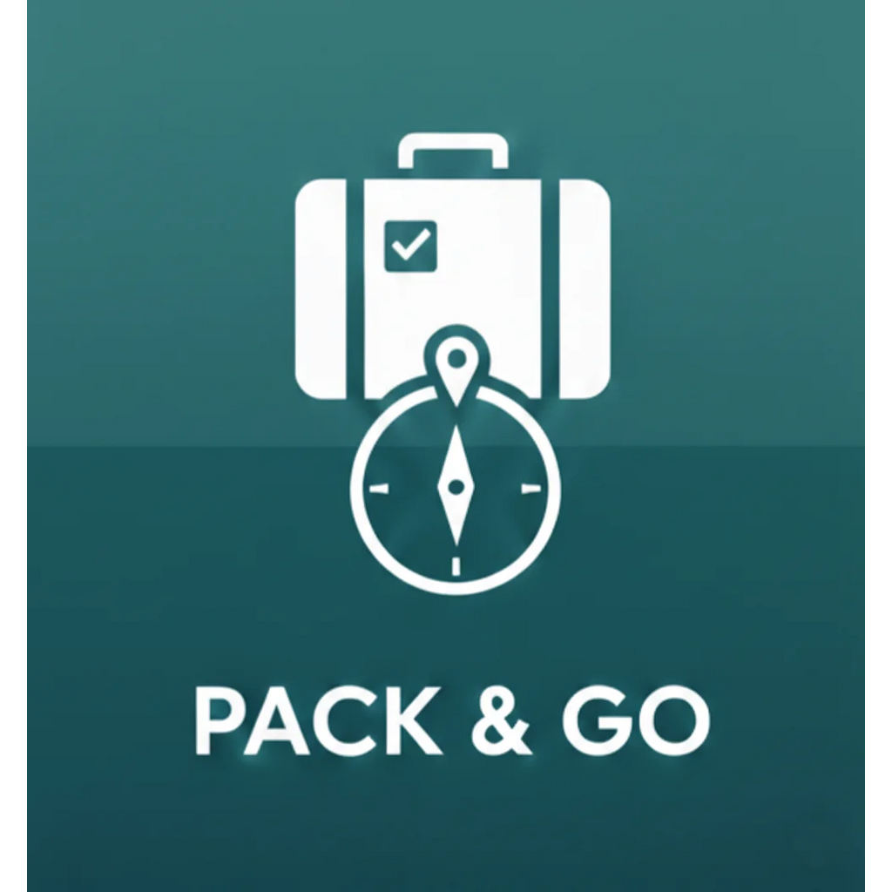

# 🧳 Pack & Go

**Organizza i tuoi bagagli per ogni tipo di viaggio**

Pack & Go è una web app per gestire le checklist dei bagagli in modo semplice e intuitivo. Perfetta per chi viaggia spesso e vuole assicurarsi di non dimenticare nulla.



## ✨ Funzionalità

- **3 tipi di viaggio**: Auto 🚗, Europa 🇪🇺, Mondo 🌍
- **Checklist intelligente**: ogni oggetto può essere associato a uno o più tipi di viaggio
- **Categorie collassabili**: interfaccia pulita e organizzata
- **Salva template**: riutilizza i viaggi completati per partire ancora più velocemente
- **Progress tracking**: barra di avanzamento per vedere cosa hai già preparato
- **Dati precaricati**: 32 oggetti già configurati in 6 categorie
- **Import/Export**: backup e ripristino dei dati in formato `.packgo`
- **100% Offline**: funziona senza connessione internet
- **PWA Ready**: installabile come app su smartphone

## 📱 Design

- **Mobile-first**: ottimizzato per smartphone con effetto glassmorphism
- **Desktop**: layout a due colonne con sfondo immersivo
- **Sfondi dinamici**: cambiano in base al tipo di viaggio
- **Dark mode**: design scuro elegante

## 🚀 Demo

[**Prova Pack & Go →**](https://tuousername.github.io/pack-and-go/)

## 📦 Installazione

1. Clona il repository:
```bash
git clone https://github.com/tuousername/pack-and-go.git
```

2. Apri `index.html` nel browser

Oppure carica i file su GitHub Pages per avere la tua versione online.

## 🗂️ Struttura

```
pack-and-go/
├── index.html          # Pagina principale
├── app.js              # Logica applicazione
├── mobile.css          # Stili mobile (< 1024px)
├── desktop.css         # Stili desktop (≥ 1024px)
├── site.webmanifest    # Configurazione PWA
├── README.md
└── img/
    ├── logo_pack_and_go.png
    ├── car.png         # Sfondo viaggio auto
    ├── europe.png      # Sfondo viaggio Europa
    ├── world.png       # Sfondo viaggio mondo
    └── desktop.png     # Sfondo desktop
```

## 🎯 Come Usare

### Preparare un nuovo viaggio

1. Clicca su **"Prepara Valigia"**
2. Inserisci il nome del viaggio
3. Seleziona il tipo (Auto/Europa/Mondo)
4. Clicca **"Parti!"**

### Durante il viaggio

- Clicca sulle **categorie** per espandere/chiudere
- Spunta gli oggetti man mano che li prepari
- La barra di progresso mostra l'avanzamento

### Salvare un template

1. Clicca sul menu **⋮** in alto a destra
2. Seleziona **"Salva come template"**
3. Il viaggio sarà disponibile nella home per riutilizzarlo

### Gestire gli oggetti

1. Clicca sull'icona **⚙️** nella home
2. Espandi le categorie per vedere gli oggetti
3. Clicca sulle emoji 🚗🇪🇺🌍 per attivare/disattivare i tipi
4. Usa **+** per aggiungere nuovi oggetti o categorie

## 📋 Oggetti Precaricati

| Categoria | Oggetti |
|-----------|---------|
| **Documenti** | Carta d'identità, Passaporto, Patente, Tessera sanitaria, Assicurazione viaggio |
| **Elettronica** | Smartphone, Caricatore, Power bank, Cuffie, Adattatore presa |
| **Igiene** | Spazzolino, Dentifricio, Deodorante, Shampoo, Rasoio, Medicinali |
| **Abbigliamento** | Mutande, Calzini, Magliette, Pantaloni, Felpa, Pigiama, Costume |
| **Accessori** | Occhiali da sole, Cappello, Cintura, Orologio |
| **Varie** | Portafoglio, Chiavi casa, Ombrello, Borraccia, Snack |

## 🛠️ Tecnologie

- **HTML5** / **CSS3** / **JavaScript ES6+**
- **IndexedDB** via [Dexie.js](https://dexie.org/) per la persistenza dati
- **CSS Media Queries** per il responsive design
- **Glassmorphism** per l'effetto vetro smerigliato
- **PWA** con Web App Manifest

## 🔒 Privacy

- **Nessun dato viene inviato online**
- Tutti i dati sono salvati localmente nel browser (IndexedDB)
- Funziona completamente offline

## 📄 Licenza

MIT License - Usa liberamente per progetti personali e commerciali.

---

Made with ❤️ by **PwR** — per scopo didattico e per chi ama viaggiare ✈️
